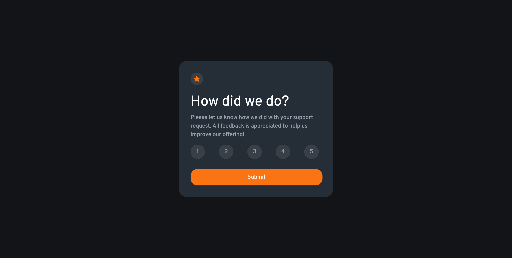

# Frontend Mentor - Interactive rating component solution

This is a solution to the [Interactive rating component challenge on Frontend Mentor](https://www.frontendmentor.io/challenges/interactive-rating-component-koxpeBUmI). Frontend Mentor challenges help you improve your coding skills by building realistic projects. 

## Table of contents

- [Overview](#overview)
  - [The challenge](#the-challenge)
  - [Screenshot](#screenshot)
  - [Links](#links)
- [My process](#my-process)
  - [Built with](#built-with)
  - [What I learned](#what-i-learned)
  - [Useful resources](#useful-resources)
- [Author](#author)

**Note: Delete this note and update the table of contents based on what sections you keep.**

## Overview

### The challenge

Users should be able to:

- View the optimal layout for the app depending on their device's screen size
- See hover states for all interactive elements on the page
- Select and submit a number rating
- See the "Thank you" card state after submitting a rating

### Screenshot



### Links

- [Solution URL](https://github.com/ttekie/Interactive-Rating-Component)
- [Live Site URL](https://ttekie.github.io/Interactive-Rating-Component/)

## My process

### Built with

- Semantic HTML5 markup
- CSS custom properties
- Flexbox
- CSS Grid
- CSS Preprocessor SASS
- Vanilla Js

### What I learned
While working in this project I utilized sass and learned how to implement custom variables, nesting and inheritance. To dynamically add the rating value to the thank you card once the user submit the rating value I utilized vanilla js but I will refactor the code to jQuery to just practice on it. Once I refactor the code I will just comment the old code for future reference.

code snippets of the codes that I am proud off, see below:

```css preprocessor sass
%radio-shared {
   width: 40px;
   height: 40px;
   border-radius: 50%;
}
.rating-item {
   display: flex;
   // nested child element
   input[type="radio"] {
     @extend %radio-shared;
     border: none;
   }
   // nested child element
   .rating-label {
      @extend %radio-shared;
      display: grid;
      place-content: center;
      transform: translateX(-100%);
      font-size: 1rem;
      background-color: $dark-grey;
      color: $light-grey;
      outline: none;
   }
   .rating-label:hover {
      background-color: $orange;
      color: $white;
   }
}
```
```js
  function ratingValue(callback) {
      ratingBtn.forEach(btn => {
         btn.addEventListener('click', (e) => {
            // reset rating dynamically 
            rating = e.target.textContent;
            callback(rating);
            // the block of code within this condition only executes 
            // if the condition is truthy 
            if(selectedBtn) {
               selectedBtn.style.backgroundColor = '';
            }
            selectedBtn = e.target;
            selectedBtn.style.backgroundColor = 'hsl(217, 12%, 63%)';
            selectedBtn.style.color = 'hsl(0, 0%, 100%)';
         })
      })
   }

   ratingValue(updatedRating => {
      rating = updatedRating;
   });
```
### Useful resources

- [css tricks](https://css-tricks.com/) - While working on this project, css tricks was my number one to go to refresh my memory on css Grid and css flexbox property. css tricks one of the best css resources on the internet, I would definitely recommend it.
- [sass documentation](https://sass-lang.com/) - As this is my first time using sass on a project, sass documentation was the one I used to learn and refer sass properties.

## Author

- Website - [Tesfalem Tekie](https://ttekie.github.io/portfolio/#)
- Frontend Mentor - [@ttekie](https://www.frontendmentor.io/profile/ttekie)
- Github - [@ttekie](https://github.com/ttekie)

